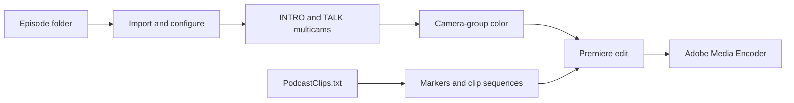

# Unscripted-Podcast

[](https://github.com/andersaucy/Unscripted-Podcast/actions/workflows/validate.yml)


An Adobe Premiere Pro automation panel for recurring podcast production. It
turns a prepared episode folder into organized media and multicam timelines,
builds timestamp-driven social clips, and queues final deliverables in Adobe
Media Encoder.

> This repository is a sanitized, view-only portfolio case study. Production
> media, credentials, personal filesystem paths, and private destinations are
> not included. It is not an open-source project and is not licensed for reuse,
> modification, redistribution, or derivative development.

## What it automates

### Episode setup

- Derives the episode number from the active `PODCAST###` project.
- Updates the `_CLIP INTRO` episode-number MOGRT and renames the LowRes sequence.
- Imports `01_Assets/Footage`, preserves its folder hierarchy, and skips duplicates.
- Applies saved MXF/WAV Audio Channels presets and labels video/audio media.
- Creates CAM1-first `INTRO-###` and `TALK-###` multicam source sequences.
- Includes the TALK sync MP3, opens both timelines, and reports persistent setup status.
- Applies Lumetri and consistent camera-group corrections to both multicams.

[Read the complete Episode Setup workflow →](docs/EPISODE_SETUP.md)

### Intelligent camera color

- Groups timeline clips by camera filename or media folder.
- Analyzes one representative frame per group with a local OpenCV engine.
- Applies one deterministic Basic Correction recommendation across each group.
- Protects highlight headroom and pauses automatic application for detected log/HDR media.
- Works inside Unscripted-Podcast and as a reusable standalone panel.

[Read how Intelligent Color works →](docs/INTELLIGENT_COLOR.md)

### Editing and delivery

- Reads local `PodcastClips.txt` timestamp ranges.
- Adds markers and builds clip sequences from Premiere templates.
- Applies standard audio/video transitions.
- Queues H.264 and MP3 deliverables through Adobe Media Encoder.
- Collects a self-contained episode copy through Premiere Project Manager.

[Read the Editing and Export workflow →](docs/EDITING_AND_EXPORT.md)

## Workflow



The panel keeps editorial decisions in Premiere while automating predictable
project setup, organization, and delivery work.

## Expected episode layout

```text
Episode 123/
├── 00_Projects/
│   ├── PODCAST123.prproj
│   └── PodcastClips.txt
└── 01_Assets/
    └── Footage/
        ├── PODCAST123-GUEST-CAM1.mxf
        ├── PODCAST123-GUEST-CAM2.mxf
        ├── PODCAST123-GUEST-AUDIO-P1.wav
        └── PODCAST123-GUEST-AUDIO-FOR-SYNC.mp3
```

The project must be saved directly inside `00_Projects`; `01_Assets` is its
sibling. Detailed naming, sequence, MOGRT, and audio-preset requirements are in
[Episode Setup](docs/EPISODE_SETUP.md).

## Portfolio focus

This project demonstrates:

- workflow analysis translated into reliable editorial automation;
- a modular CEP/ExtendScript architecture around Premiere's scripting limits;
- safe fallbacks where native dialogs or undocumented QE behavior are required;
- asynchronous local image analysis separated from Premiere project mutation;
- project-derived progress indicators, diagnostics, and regression coverage;
- privacy-conscious publication of a production tool without production assets.

The repository documents the system and engineering decisions for portfolio
review. It is not distributed as an end-user product or development starter.

## Documentation

| Guide | Contents |
| --- | --- |
| [Episode Setup](docs/EPISODE_SETUP.md) | Project identity, footage import, audio presets, multicam, sync media, and collection |
| [Intelligent Color](docs/INTELLIGENT_COLOR.md) | Camera grouping, local analysis, safeguards, configuration, and limitations |
| [Editing and Export](docs/EDITING_AND_EXPORT.md) | Timestamp notes, Mark Clips, templates, transitions, and AME delivery |
| [Technical Notes](docs/TECHNICAL_NOTES.md) | Repository structure, engineering decisions, constraints, and validation |
| [Architecture](docs/ARCHITECTURE.md) | CEP/ExtendScript boundaries, module responsibilities, and data flows |
| [Changelog](CHANGELOG.md) | Release and development history |

## Status

This is a working internal automation tool presented as a portfolio case study.
It is not an Adobe product and is not affiliated with or endorsed by Adobe.

## License and third-party code

Copyright © 2026 `andersaucy`. All rights reserved. The original project code is
published for viewing and portfolio evaluation only; no permission to use,
modify, redistribute, or commercialize it is granted. See [LICENSE.md](LICENSE.md).

`client/js/CSInterface.js` is supplied by Adobe and remains governed by Adobe's
own license terms. See [THIRD_PARTY_NOTICES.md](THIRD_PARTY_NOTICES.md).
