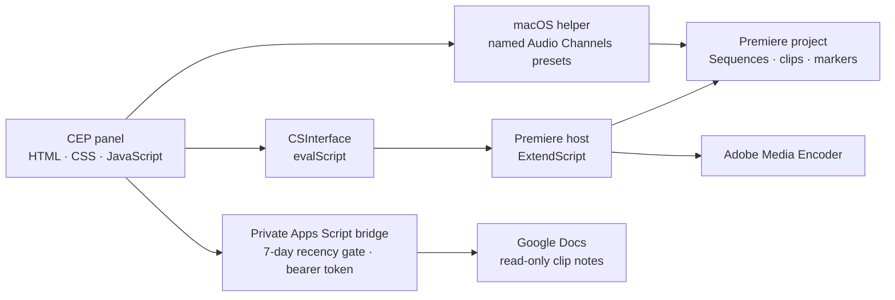

# Unscripted-Podcast

[](https://github.com/andersaucy/Unscripted-Podcast/actions/workflows/validate.yml)


A focused Adobe Premiere Pro automation panel for recurring podcast editing and
delivery. It turns timestamp notes into export-ready sequences, automates episode
media setup, and queues multi-format deliverables in Adobe Media Encoder.

> Portfolio note: this repository is a sanitized development snapshot. Personal
> filesystem paths and production-specific destinations have been replaced with
> portable defaults. The source is published for portfolio review; it is not
> released under an open-source license.

## Why it exists

Podcast production often repeats the same mechanical work: translate timestamp
notes into markers, duplicate templates, build social clips, organize media,
and queue several output formats. Unscripted-Podcast consolidates those
steps into one Premiere panel while keeping editorial decisions inside Premiere.

## Features

### Episode footage setup

- Resolves `01_Assets/Footage` beside the active project's parent folder,
  `00_Projects`.
- Recursively imports media without opening Finder or Explorer.
- Mirrors the on-disk directory hierarchy beneath a Premiere `Footage` bin.
- Compares normalized media paths and skips clips already in the project.
- Imports files independently so an unsupported sidecar cannot block a folder.
- Batch-selects MXF and WAV clips in the `Footage` bin and applies the saved
  Audio Channels presets `Unscripted-MXF1` and `Unscripted-WAV3` on macOS.
- Uses semantic macOS Accessibility controls rather than screen coordinates to
  select each preset in Premiere's native Modify Clip dialog.
- Retains the direct source-audio mapping path for Premiere versions where the
  legacy API remains writable.
- Detects the Premiere 26.x read-only audio-mapping regression instead of
  reporting false success.
- Shows persistent imported-footage and configured-audio checks in the panel,
  derived from the active project rather than button-click history.
- Writes the project episode number to the AE MOGRT control named
  `Episode Number` on V2 of `_CLIP INTRO` and renames `LowRes` to
  `### LowRes_v1` before the longer footage import and MXF/WAV preset stages,
  with independent completion badges.
- Verifies the numeric MOGRT value directly and rejects missing or ambiguous
  controls without relying on Effect Controls UI automation.
- Provides an expandable full-panel activity log for long import, audio, and
  multicam diagnostics.
- Applies Premiere's Teal label to video and Green label to audio sourced from
  `01_Assets/Footage`, even after media is moved into another project bin.
- Prepares a clean bin for Premiere's supported multicamera creation workflow.
- Creates `INTRO-###` and `TALK-###` multicamera source sequences from flexible
  episode filename stems, always ordering CAM1 first.
- Keeps multicam creation independent from the separate **Finish TALK Layout**
  action, so optional Zencastr placement cannot block a valid multicam result.
- Opens both verified multicam source sequences as Timeline tabs and leaves
  `TALK-###` active when creation finishes.
- Includes matching recorder WAVs and prefers a unique MP3 containing
  `audio for sync` or `Zencastr` as the TALK sync proxy. After synchronization,
  it places the Zencastr MOV on a new track at the MP3's exact timeline start.
- Falls back to direct Zencastr MOV synchronization when no proxy MP3 exists.
- Finishes TALK as CAM1 / Zencastr / CAM2 / CAM3 / CAM4 on V1-V5, with the
  recorder's three WAV mono channels on A1-A3, the sync MP3 on A4, Zencastr
  audio on A5, and preserved camera audio on A6 and below.
- Verifies exact sequence creation, safely skips completed work, and refuses
  ambiguous stems, offline media, or uncertain Zencastr matches.
- Saves the active project and uses Premiere Project Manager to create a
  self-contained episode copy beside `01_Assets` and `00_Projects`.
- Names collected folders from the project (for example,
  `Collected - Episode123`) and avoids overwriting previous collections.

#### Operational notes

- On macOS, the first saved-audio-preset run may request Accessibility
  permission to control Premiere Pro. The `Unscripted-MXF1` and
  `Unscripted-WAV3` presets must exist in the active Premiere profile.
- For the optional TALK sidecar workflow, name the proxy MP3 with
  `audio for sync` or `Zencastr`. Multicam creation and TALK/Zencastr finishing
  remain separate actions so a sidecar problem cannot block multicam creation.

### Timestamp-driven clip assembly

- The **Mark Clips** feature optionally lists only Google Docs viewed during the previous seven days,
  ranks names containing the active project's `PODCAST###` episode first, and
  validates `TITLE`/`FROM`/`TO` without changing the document format.
- Saves the selected Doc as `PodcastClips.txt`, backs up an existing local
  file, and immediately runs the established Mark Clips workflow.
- Keeps the Apps Script endpoint and bearer token in a gitignored local config;
  the repository contains only a sanitized example and generic bridge source.
- Keeps local `PodcastClips.txt` as a source option inside the same Mark Clips
  chooser and discovers it beside the active Premiere project.
- Parses titled `FROM`/`TO` ranges.
- Automatically uses the number of valid ranges; no manual clip count is
  required.
- Adds segmentation markers to the episode-aware `### LowRes_v1` sequence.
- Clones full-episode and `CLIP` template sequences into `ExportBin`.
- Inserts each range and applies Cross Dissolve and Constant Power transitions.
- Detects invalid, inverted, and zero-length ranges before editing the project.

### Adobe Media Encoder delivery

- Recursively discovers sequences inside `ExportBin`.
- Queues H.264 video and MP3 audio deliverables.
- Sanitizes sequence names for safe output filenames.
- Supports configurable presets, output locations, and optional batch start.

## Architecture



The CEP interface calls modular ExtendScript tasks through Adobe's
`CSInterface.evalScript` bridge. Premiere project mutations remain in the host
layer.

See [Architecture](docs/ARCHITECTURE.md) for module responsibilities and data
flows.

## Project structure

```text
.
├── CSXS/manifest.xml          CEP extension manifest
├── client/
│   ├── index.html             Panel markup
│   ├── css/style.css          Premiere-style interface
│   └── js/
│       ├── main.js            Panel UI orchestration
│       ├── googleDocs.js       Private Doc chooser and safe local cache
│       └── CSInterface.js     Adobe CEP bridge
│   └── scripts/
│       ├── applyAudioChannelPreset.applescript
│       └── createEpisodeMulticam.applescript
├── host/
│   ├── index.jsx              Shared helpers and task includes
│   ├── episodeIdentity.jsx    Episode graphic and LowRes naming
│   ├── episodeSetup.jsx       Footage import and audio interpretation
│   ├── multicamSetup.jsx      INTRO/TALK discovery and selection
│   ├── collectEpisode.jsx     Premiere Project Manager collection workflow
│   ├── markClips.jsx          Timestamp-to-sequence workflow
│   └── renderUnscripted.jsx   Adobe Media Encoder queueing
├── config/
│   └── google-docs.example.json  Sanitized optional-integration template
├── integrations/
│   └── google-apps-script/    Deployable read-only Docs bridge
├── docs/ARCHITECTURE.md
└── scripts/validate.sh
```

## Requirements

- Adobe Premiere Pro 24.0 or newer.
- A CEP-compatible development environment.
- Adobe Media Encoder for queued exports.
- On macOS, the saved Premiere Audio Channels presets `Unscripted-MXF1` and
  `Unscripted-WAV3`, plus permission for Premiere Pro to control System Events.
- Node.js and `xmllint` only for repository validation.
- Optional Google Docs import requires a private Apps Script deployment and
  local `config/google-docs.json`; local TXT operation requires neither.

On macOS with Homebrew:

```bash
brew install libxml2
```

## Installation for development

Clone the repository:

```bash
git clone https://github.com/andersaucy/Unscripted-Podcast.git
```

Place the repository—or a symbolic link to it—in the user CEP extensions
directory:

```text
macOS:   ~/Library/Application Support/Adobe/CEP/extensions/
Windows: %APPDATA%\Adobe\CEP\extensions\
```

Because this is an unsigned development extension, CEP debug mode must be
enabled for the installed CSXS runtime. Restart Premiere after installing or
updating the panel, then open **Window → Extensions → Unscripted-Podcast**.

## Project conventions

The baseline workflow expects:

- A saved project directly inside `00_Projects`.
- A `01_Assets/Footage` folder beside `00_Projects`.
- A legacy sequence named `LowRes` (renamed automatically to `### LowRes_v1`).
- A sequence named `_CLIP INTRO` with one AE MOGRT on V2 exposing a numeric
  control named `Episode Number`.
- A template sequence named `CLIP`.
- Timestamp notes named `PodcastClips.txt` beside the saved project.
- Generated sequences collected beneath `ExportBin`.

`Unscripted-MXF1` should contain one mono clip mapped to source channel 1.
`Unscripted-WAV3` should contain three mono clips mapped to source channels 5,
6, and 7.

```text
Episode 123/
├── 00_Projects/
│   ├── Episode123.prproj
│   └── PodcastClips.txt
└── 01_Assets/
    └── Footage/
        ├── CameraA.mxf
        └── Recorder.wav
```

Example timestamp file:

```text
TITLE= Episode 123

TITLE= The opening story
FROM= 1:24
TO= 3:08

TITLE= A useful takeaway
FROM= 12:40
TO= 14:02
```

## Optional Google Docs clip notes

The **Mark Clips** window shows Google Docs viewed in the last seven days, ranks documents whose
names contain the active project episode number first, previews only the file
you select, validates its existing timestamp format, and saves it as
`PodcastClips.txt`. The local TXT button remains available when Google is
unavailable.

Follow the one-time [Google Docs bridge setup](integrations/google-apps-script/README.md).
Never commit `config/google-docs.json`, Apps Script deployment IDs, access
tokens, production document IDs, names, or contents. Repository
validation fails if the private config becomes tracked.

## Export configuration

The default export task looks for:

```text
Documents/
└── Adobe/Adobe Media Encoder/26.0/Presets/
    ├── YouTube-1080.epr
    └── Mp3-Export.epr
```

Exports are written to `Podcast Exports` on the current user's Desktop. Update
the configuration block near the top of `host/renderUnscripted.jsx` when preset
versions, names, or destinations differ.

## Validation

Run the same checks used by CI:

```bash
bash scripts/validate.sh
```

The script verifies:

- Panel JavaScript syntax.
- ExtendScript module syntax where Node parsing is compatible.
- CEP manifest XML validity.
- Expected extension entry points.

Premiere DOM behavior still requires an integration test inside Premiere with
representative project media.

## Engineering decisions

- **Additive task modules:** each panel action lives in a focused host module.
- **Structured host responses:** ExtendScript tasks return serialized status,
  message, and log data instead of blocking alerts.
- **Graceful degradation:** missing projects, sequences, timestamp files, or
  presets produce actionable panel errors.
- **Portable public configuration:** user-specific paths are not committed.

## Roadmap

- Configurable episode folder and channel-mapping profiles.
- Camera-label metadata derived from filename patterns.
- Import progress events for very large episode folders.
- Native multicamera creation when Adobe exposes a supported scripting API.
- Configurable export presets through the panel UI.

## Status

This is a working internal automation tool presented as a portfolio case study.
It is not an Adobe product and is not affiliated with or endorsed by Adobe.

See [CHANGELOG.md](CHANGELOG.md) for repository history.

## License and third-party code

Copyright © 2026 `andersaucy`. All rights reserved. The original project code is
published for viewing and portfolio evaluation only; no permission to use,
modify, redistribute, or commercialize it is granted. See [LICENSE.md](LICENSE.md).

`client/js/CSInterface.js` is supplied by Adobe and remains governed by Adobe's
own license terms. See [THIRD_PARTY_NOTICES.md](THIRD_PARTY_NOTICES.md).
