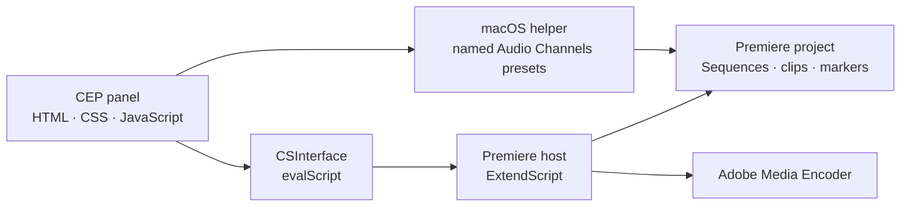

# Unscripted-Podcast

[](https://github.com/andersaucy/Unscripted-Podcast/actions/workflows/validate.yml)


A focused Adobe Premiere Pro automation panel for recurring podcast editing and
delivery. It turns timestamp notes into export-ready sequences, automates episode
media setup, and queues multi-format deliverables in Adobe Media Encoder.

> Portfolio note: this repository is a sanitized development snapshot. Personal
> filesystem paths and production-specific destinations have been replaced with
> portable defaults. The source is published for portfolio review; it is not
> released under an open-source license.

## Why it exists

Podcast production often repeats the same mechanical work: translate timestamp
notes into markers, duplicate templates, build social clips, organize media,
and queue several output formats. Unscripted-Podcast consolidates those
steps into one Premiere panel while keeping editorial decisions inside Premiere.

## Features

### Episode footage setup

- Resolves `01_Assets/Footage` beside the active project's parent folder,
  `00_Projects`.
- Recursively imports media without opening Finder or Explorer.
- Mirrors the on-disk directory hierarchy beneath a Premiere `Footage` bin.
- Compares normalized media paths and skips clips already in the project.
- Imports files independently so an unsupported sidecar cannot block a folder.
- Batch-selects MXF and WAV clips in the `Footage` bin and applies the saved
  Audio Channels presets `Unscripted-MXF1` and `Unscripted-WAV3` on macOS.
- Uses semantic macOS Accessibility controls rather than screen coordinates to
  select each preset in Premiere's native Modify Clip dialog.
- Retains the direct source-audio mapping path for Premiere versions where the
  legacy API remains writable.
- Detects the Premiere 26.x read-only audio-mapping regression instead of
  reporting false success.
- Prepares a clean bin for Premiere's supported multicamera creation workflow.
- Saves the active project and uses Premiere Project Manager to create a
  self-contained episode copy beside `01_Assets` and `00_Projects`.
- Names collected folders from the project (for example,
  `Collected - Episode123`) and avoids overwriting previous collections.

### Timestamp-driven clip assembly

- Discovers `PodcastClips.txt` beside the active Premiere project.
- Parses titled `FROM`/`TO` ranges.
- Automatically uses the number of valid ranges; no manual clip count is
  required.
- Adds segmentation markers to the `LowRes` sequence.
- Clones full-episode and `CLIP` template sequences into `ExportBin`.
- Inserts each range and applies Cross Dissolve and Constant Power transitions.
- Detects invalid, inverted, and zero-length ranges before editing the project.

### Adobe Media Encoder delivery

- Recursively discovers sequences inside `ExportBin`.
- Queues H.264 video and MP3 audio deliverables.
- Sanitizes sequence names for safe output filenames.
- Supports configurable presets, output locations, and optional batch start.

## Architecture



The CEP interface calls modular ExtendScript tasks through Adobe's
`CSInterface.evalScript` bridge. Premiere project mutations remain in the host
layer.

See [Architecture](docs/ARCHITECTURE.md) for module responsibilities and data
flows.

## Project structure

```text
.
├── CSXS/manifest.xml          CEP extension manifest
├── client/
│   ├── index.html             Panel markup
│   ├── css/style.css          Premiere-style interface
│   └── js/
│       ├── main.js            Panel UI orchestration
│       └── CSInterface.js     Adobe CEP bridge
│   └── scripts/
│       └── applyAudioChannelPreset.applescript
├── host/
│   ├── index.jsx              Shared helpers and task includes
│   ├── episodeSetup.jsx       Footage import and audio interpretation
│   ├── collectEpisode.jsx     Premiere Project Manager collection workflow
│   ├── markClips.jsx          Timestamp-to-sequence workflow
│   └── renderUnscripted.jsx   Adobe Media Encoder queueing
├── docs/ARCHITECTURE.md
└── scripts/validate.sh
```

## Requirements

- Adobe Premiere Pro 24.0 or newer.
- A CEP-compatible development environment.
- Adobe Media Encoder for queued exports.
- On macOS, the saved Premiere Audio Channels presets `Unscripted-MXF1` and
  `Unscripted-WAV3`, plus permission for Premiere Pro to control System Events.
- Node.js and `xmllint` only for repository validation.

On macOS with Homebrew:

```bash
brew install libxml2
```

## Installation for development

Clone the repository:

```bash
git clone https://github.com/andersaucy/Unscripted-Podcast.git
```

Place the repository—or a symbolic link to it—in the user CEP extensions
directory:

```text
macOS:   ~/Library/Application Support/Adobe/CEP/extensions/
Windows: %APPDATA%\Adobe\CEP\extensions\
```

Because this is an unsigned development extension, CEP debug mode must be
enabled for the installed CSXS runtime. Restart Premiere after installing or
updating the panel, then open **Window → Extensions → Unscripted-Podcast**.

## Project conventions

The baseline workflow expects:

- A saved project directly inside `00_Projects`.
- A `01_Assets/Footage` folder beside `00_Projects`.
- A sequence named `LowRes`.
- A template sequence named `CLIP`.
- Timestamp notes named `PodcastClips.txt` beside the saved project.
- Generated sequences collected beneath `ExportBin`.

`Unscripted-MXF1` should contain one mono clip mapped to source channel 1.
`Unscripted-WAV3` should contain three mono clips mapped to source channels 5,
6, and 7.

```text
Episode 123/
├── 00_Projects/
│   ├── Episode123.prproj
│   └── PodcastClips.txt
└── 01_Assets/
    └── Footage/
        ├── CameraA.mxf
        └── Recorder.wav
```

Example timestamp file:

```text
TITLE= Episode 123

TITLE= The opening story
FROM= 1:24
TO= 3:08

TITLE= A useful takeaway
FROM= 12:40
TO= 14:02
```

## Export configuration

The default export task looks for:

```text
Documents/
└── Adobe/Adobe Media Encoder/26.0/Presets/
    ├── YouTube-1080.epr
    └── Mp3-Export.epr
```

Exports are written to `Podcast Exports` on the current user's Desktop. Update
the configuration block near the top of `host/renderUnscripted.jsx` when preset
versions, names, or destinations differ.

## Validation

Run the same checks used by CI:

```bash
bash scripts/validate.sh
```

The script verifies:

- Panel JavaScript syntax.
- ExtendScript module syntax where Node parsing is compatible.
- CEP manifest XML validity.
- Expected extension entry points.

Premiere DOM behavior still requires an integration test inside Premiere with
representative project media.

## Engineering decisions

- **Additive task modules:** each panel action lives in a focused host module.
- **Structured host responses:** ExtendScript tasks return serialized status,
  message, and log data instead of blocking alerts.
- **Graceful degradation:** missing projects, sequences, timestamp files, or
  presets produce actionable panel errors.
- **Portable public configuration:** user-specific paths are not committed.

## Roadmap

- Configurable episode folder and channel-mapping profiles.
- Camera-label metadata derived from filename patterns.
- Import progress events for very large episode folders.
- Native multicamera creation when Adobe exposes a supported scripting API.
- Configurable export presets through the panel UI.

## Status

This is a working internal automation tool presented as a portfolio case study.
It is not an Adobe product and is not affiliated with or endorsed by Adobe.

See [CHANGELOG.md](CHANGELOG.md) for repository history.

## License and third-party code

Copyright © 2026 `andersaucy`. All rights reserved. The original project code is
published for viewing and portfolio evaluation only; no permission to use,
modify, redistribute, or commercialize it is granted. See [LICENSE.md](LICENSE.md).

`client/js/CSInterface.js` is supplied by Adobe and remains governed by Adobe's
own license terms. See [THIRD_PARTY_NOTICES.md](THIRD_PARTY_NOTICES.md).
