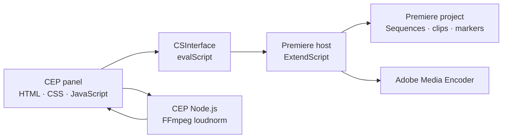

# Unscripted-Podcast

[](https://github.com/andersaucy/Unscripted-Podcast/actions/workflows/validate.yml)


A focused Adobe Premiere Pro automation panel for recurring podcast editing and
delivery. It turns timestamp notes into export-ready sequences, normalizes quiet
dialogue with measured LUFS data, and queues multi-format deliverables in Adobe
Media Encoder.

> Portfolio note: this repository is a sanitized development snapshot. Personal
> filesystem paths and production-specific destinations have been replaced with
> portable defaults. The source is published for portfolio review; it is not
> released under an open-source license.

## Why it exists

Podcast production often repeats the same mechanical work: translate timestamp
notes into markers, duplicate templates, build social clips, check dialogue
loudness, and queue several output formats. Unscripted-Podcast consolidates those
steps into one Premiere panel while keeping editorial decisions inside Premiere.

## Features

### Episode footage setup

- Infers `Assets/Footage` from the active saved project's `Projects` ancestor.
- Recursively imports media without opening Finder or Explorer.
- Mirrors the on-disk directory hierarchy beneath a Premiere `Footage` bin.
- Compares normalized media paths and skips clips already in the project.
- Imports files independently so an unsupported sidecar cannot block a folder.
- Interprets MXF audio as mono using embedded channel 1.
- Interprets WAV audio as three mono clips using embedded channels 5, 6, and 7.
- Provides a separate audio-configuration retry command and detailed results.
- Prepares a clean bin for Premiere's supported multicamera creation workflow.

### Timestamp-driven clip assembly

- Discovers `PodcastClips.txt` beside the active Premiere project.
- Parses titled `FROM`/`TO` ranges.
- Adds segmentation markers to the `LowRes` sequence.
- Clones full-episode and `CLIP` template sequences into `ExportBin`.
- Inserts each range and applies Cross Dissolve and Constant Power transitions.
- Detects invalid, inverted, and zero-length ranges before editing the project.

### Dialogue loudness normalization

- Enumerates dialogue clips from the active sequence.
- Supports whole-sequence or selected-clip analysis.
- Uses FFmpeg's EBU R128 `loudnorm` analysis to measure integrated LUFS.
- Calculates a duration-weighted loudness average per track.
- Boosts quiet tracks toward a configurable target without reducing loud tracks.
- Caps applied gain and reports media that could not be analyzed.

### Adobe Media Encoder delivery

- Recursively discovers sequences inside `ExportBin`.
- Queues H.264 video and MP3 audio deliverables.
- Sanitizes sequence names for safe output filenames.
- Supports configurable presets, output locations, and optional batch start.

## Architecture



The panel deliberately uses two execution environments:

- **ExtendScript** owns Premiere project mutations.
- **CEP Node.js** launches FFmpeg because Premiere's scripting DOM does not
  expose loudness measurement.

See [Architecture](docs/ARCHITECTURE.md) for module responsibilities and data
flows.

## Project structure

```text
.
├── CSXS/manifest.xml          CEP extension manifest
├── client/
│   ├── index.html             Panel markup
│   ├── css/style.css          Premiere-style interface
│   └── js/
│       ├── main.js            UI orchestration and FFmpeg analysis
│       └── CSInterface.js     Adobe CEP bridge
├── host/
│   ├── index.jsx              Shared helpers and task includes
│   ├── episodeSetup.jsx       Footage import and audio interpretation
│   ├── markClips.jsx          Timestamp-to-sequence workflow
│   ├── loudness.jsx           Clip discovery and gain application
│   └── renderUnscripted.jsx   Adobe Media Encoder queueing
├── docs/ARCHITECTURE.md
└── scripts/validate.sh
```

## Requirements

- Adobe Premiere Pro 24.0 or newer.
- A CEP-compatible development environment.
- Adobe Media Encoder for queued exports.
- [FFmpeg](https://ffmpeg.org/) for dialogue loudness analysis.
- Node.js and `xmllint` only for repository validation.

On macOS with Homebrew:

```bash
brew install ffmpeg libxml2
```

## Installation for development

Clone the repository:

```bash
git clone https://github.com/andersaucy/Unscripted-Podcast.git
```

Place the repository—or a symbolic link to it—in the user CEP extensions
directory:

```text
macOS:   ~/Library/Application Support/Adobe/CEP/extensions/
Windows: %APPDATA%\Adobe\CEP\extensions\
```

Because this is an unsigned development extension, CEP debug mode must be
enabled for the installed CSXS runtime. Restart Premiere after installing or
updating the panel, then open **Window → Extensions → Unscripted-Podcast**.

## Project conventions

The baseline workflow expects:

- A saved project inside an ancestor folder whose name contains `Projects`.
- An `Assets/Footage` folder beside that `Projects` folder.
- A sequence named `LowRes`.
- A template sequence named `CLIP`.
- Timestamp notes named `PodcastClips.txt` beside the saved project.
- Generated sequences collected beneath `ExportBin`.

Example timestamp file:

```text
TITLE= Episode 123

TITLE= The opening story
FROM= 1:24
TO= 3:08

TITLE= A useful takeaway
FROM= 12:40
TO= 14:02
```

## Export configuration

The default export task looks for:

```text
Documents/
└── Adobe/Adobe Media Encoder/26.0/Presets/
    ├── YouTube-1080.epr
    └── Mp3-Export.epr
```

Exports are written to `Podcast Exports` on the current user's Desktop. Update
the configuration block near the top of `host/renderUnscripted.jsx` when preset
versions, names, or destinations differ.

## Validation

Run the same checks used by CI:

```bash
bash scripts/validate.sh
```

The script verifies:

- Panel JavaScript syntax.
- ExtendScript module syntax where Node parsing is compatible.
- CEP manifest XML validity.
- Expected extension entry points.

Premiere DOM behavior and media-dependent loudness analysis still require an
integration test inside Premiere with representative project media.

## Engineering decisions

- **Additive task modules:** each panel action lives in a focused host module.
- **Structured host responses:** ExtendScript tasks return serialized status,
  message, and log data instead of blocking alerts.
- **Graceful degradation:** missing projects, sequences, timestamp files,
  presets, FFmpeg, or analyzable media produce actionable panel errors.
- **Sequential analysis:** clips are measured one at a time to keep CPU use and
  diagnostic output predictable.
- **Portable public configuration:** user-specific paths are not committed.

## Roadmap

- Configurable episode folder and channel-mapping profiles.
- Camera-label metadata derived from filename patterns.
- Import progress events for very large episode folders.
- Native multicamera creation when Adobe exposes a supported scripting API.
- Configurable export presets through the panel UI.

## Status

This is a working internal automation tool presented as a portfolio case study.
It is not an Adobe product and is not affiliated with or endorsed by Adobe.

See [CHANGELOG.md](CHANGELOG.md) for repository history.

## License and third-party code

Copyright © 2026 `andersaucy`. All rights reserved. The original project code is
published for viewing and portfolio evaluation only; no permission to use,
modify, redistribute, or commercialize it is granted. See [LICENSE.md](LICENSE.md).

`client/js/CSInterface.js` is supplied by Adobe and remains governed by Adobe's
own license terms. See [THIRD_PARTY_NOTICES.md](THIRD_PARTY_NOTICES.md).
