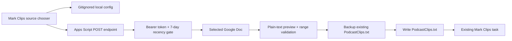
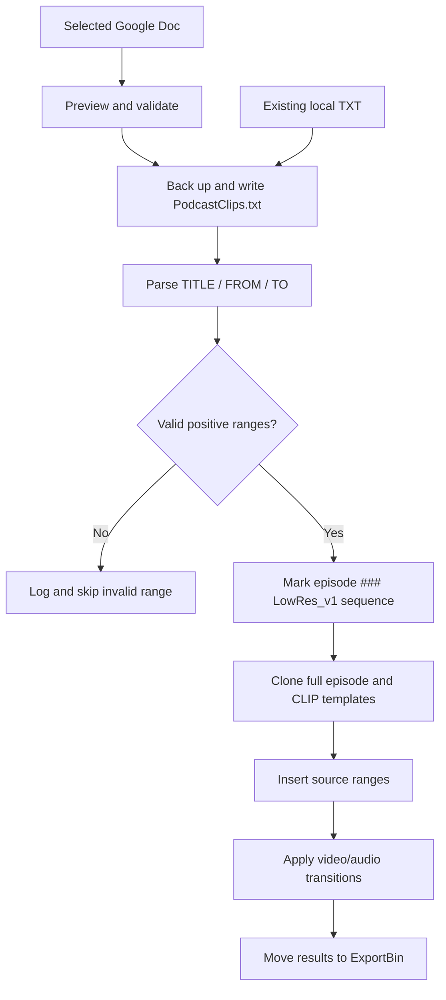
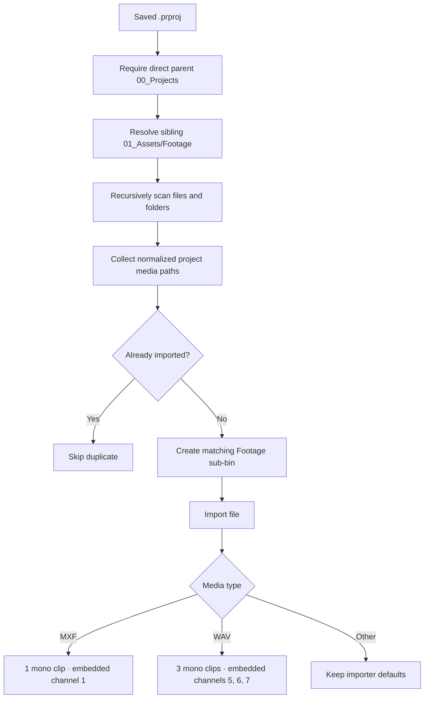
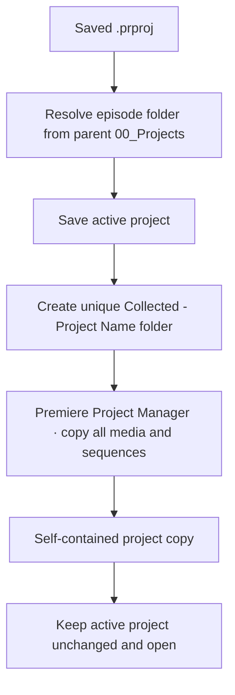

# Architecture

## Overview

Unscripted-Podcast is an Adobe CEP panel with two cooperating layers:

1. A browser-based panel UI.
2. ExtendScript modules running inside Premiere Pro.
This division keeps project mutations in the host application and the interface
focused on task orchestration and feedback.

## Runtime boundaries

### CEP client

`client/index.html`, `client/css/style.css`, and `client/js/main.js` render the
panel and coordinate tasks.

Responsibilities:

- Collect user configuration.
- Maintain busy, success, and failure states.
- Call host functions through `CSInterface.evalScript`.
- Parse structured host results.
- Present a timestamped diagnostic log.
- Use the optional Node-enabled `googleDocs.js` boundary for HTTPS requests and
  local UTF-8 file writes; credentials never cross into ExtendScript.

### Optional Google Docs bridge



The Google-side source and example configuration are safe to publish. The real
endpoint/token pair is loaded only from `config/google-docs.json`, which is
ignored and rejected by repository validation if accidentally tracked. The
Apps Script returns only Docs viewed in the previous seven days, ranks an exact
three-digit episode match first, rechecks the selected file's recency before
returning text, caps list/content sizes, and never logs request bodies or text.

### ExtendScript host

`host/index.jsx` is the manifest entry point. It supplies shared JSON helpers
and includes the task modules loaded into Premiere's ExtendScript runtime.

| Module | Responsibility |
| --- | --- |
| `episodeIdentity.jsx` | Derive `PODCAST###`, set the numeric `Episode Number` control on the single V2 AE MOGRT in `_CLIP INTRO`, migrate `LowRes` to `### LowRes_v1`, and provide shared sequence lookup helpers. |
| `episodeSetup.jsx` | Infer the episode media folder, mirror disk hierarchy as bins, skip duplicates, import footage, select matching Project-panel items, and apply recorder-specific source audio mappings. |
| `multicamSetup.jsx` | Discover and validate INTRO/TALK source groups, derive the podcast number and flexible TALK stem, order CAM1 first, select sources, verify native multicam creation, and align a Zencastr MOV from its synchronized MP3 proxy. |
| `applyAudioChannelPreset.applescript` | On macOS, select an exact named preset in Premiere's native Modify Clip dialog and confirm it without coordinate-based clicks. |
| `createEpisodeMulticam.applescript` | On macOS, configure and submit Premiere's native Create Multi-Camera Source Sequence dialog using semantic controls. |
| `collectEpisode.jsx` | Save the active project and use Premiere Project Manager to create a non-destructive, self-contained episode copy. |
| `markClips.jsx` | Parse timestamps, create markers, clone templates, assemble clip sequences, and add transitions. |
| `renderUnscripted.jsx` | Discover export sequences and queue configured Adobe Media Encoder jobs. |

Host entry points use the `up_` prefix and return a consistent payload:

```json
{
  "ok": true,
  "message": "Human-readable summary",
  "log": "Detailed diagnostic output"
}
```

ExtendScript lacks a native JSON serializer in the targeted runtime, so
`host/index.jsx` constructs and escapes these responses explicitly.

## Timestamp workflow



## Episode setup workflow



## Episode collection workflow



Premiere's ExtendScript API does not support creating a new multicamera source
sequence. The host therefore performs deterministic discovery, ordering, and
selection, while an isolated macOS Accessibility helper configures Premiere's
supported **Clip → Create Multi-Camera Source Sequence** dialog. The helper
changes only the custom name and audio sync channel; Premiere retains every
other dialog default. The host then verifies the exact `INTRO-###` or
`TALK-###` sequence name.

For TALK media with unreliable Zencastr MOV audio, the discovery layer prefers
one matching MP3 containing `audio for sync` or `Zencastr`. The MOV stays out of
the native audio-analysis pass. After the MP3 is synchronized, the host reads
its resulting `TrackItem.start` and overwrites the MOV at that time on newly
addressed video/audio tracks. This avoids rippling the synchronized sequence and
is idempotent when the workflow is resumed.

The panel deliberately exposes this post-processing as **Finish TALK Layout**,
separate from **Create Episode Multicams**. Core multicam creation ends after
exact sequence verification and never depends on Add Tracks or MOV placement.

Before that overwrite, a semantic macOS helper uses Premiere's native Add
Tracks dialog to insert V2 after CAM1 and reserve five new audio tracks before
the existing audio. That native insertion shifts all camera audio safely to A6
and below. The host then verifies and finishes CAM1/Zencastr/CAM2/CAM3/CAM4 on
V1-V5, the three WAV mono channels on A1-A3, sync MP3 on A4, and MOV audio on
A5. Only duplicate WAV/MP3 instances below the reserved area are removed.

## Design constraints

The panel's primary setup action is a client-side sequence: it first updates
the `_CLIP INTRO` episode graphic and migrates `LowRes` to `### LowRes_v1`,
then calls the host import function and applies the two native Audio Channels
presets. It refreshes three project-derived badges inside the same button.
Identity failures stop before the longer import; a successful no-op import
(all paths already present) still allows audio configuration to run.

- CEP and ExtendScript are legacy Adobe technologies, but they expose host
  capabilities that were required when this tool was built.
- QE DOM is used only for transitions. QE is undocumented, so calls are isolated
  in the clip-building task.
- Adobe Media Encoder preset paths and output destinations are configuration,
  not secrets, and use portable defaults in source control.
- Source audio-channel interpretation first uses Premiere's legacy
  `ProjectItem` mapping API where it is writable. Some Premiere 26.x builds
  expose its format/count properties as read-only. On macOS, Configure Footage
  Audio works around that regression by batch-selecting Project items, opening
  Premiere's native Audio Channels dialog, and choosing `Unscripted-MXF1` or
  `Unscripted-WAV3` through semantic Accessibility controls. This helper is
  deliberately isolated and does not use screen coordinates.

## Failure handling

Tasks validate their prerequisites before modifying the project:

- Open and saved Premiere project.
- Expected source/template sequences.
- Parseable timestamp file.
- Valid timestamp ranges.
- Existing export bin and Media Encoder presets.
- Valid Google Apps Script URL, private token, seven-day recent document,
  response size, and timestamp preview before downloaded text is written.

The panel disables conflicting actions while a task runs and surfaces detailed
diagnostics without relying on modal alerts.

## Testing strategy

Repository automation performs fast static validation:

- JavaScript syntax.
- ExtendScript module syntax where compatible with Node's parser.
- Manifest XML well-formedness.
- Required entry-point presence.
- Google Docs text parsing, endpoint allowlisting, backup behavior, and a guard
  against tracking the private configuration.

Integration validation remains manual because Premiere's DOM, QE calls, media
decoding, and Media Encoder queueing require an installed Adobe host and sample
project.
