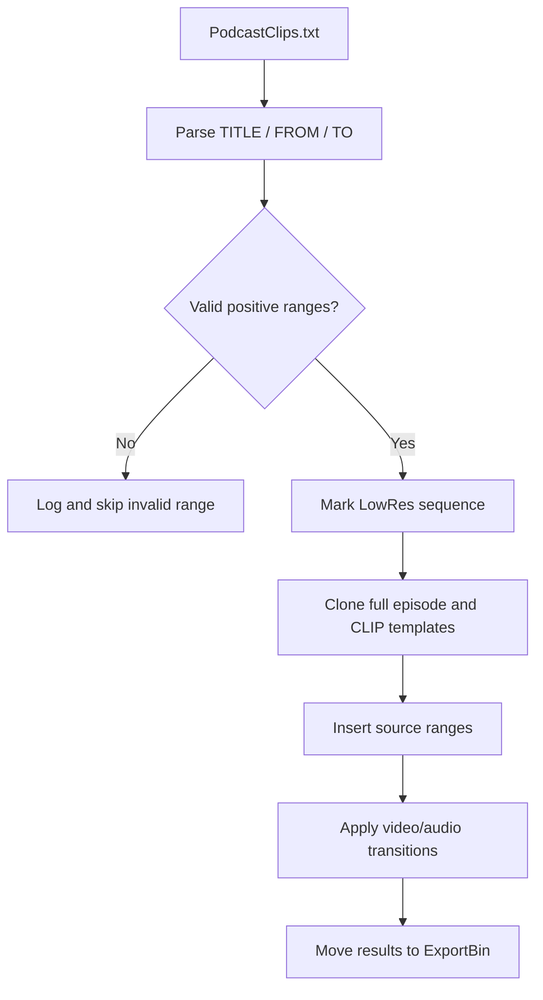
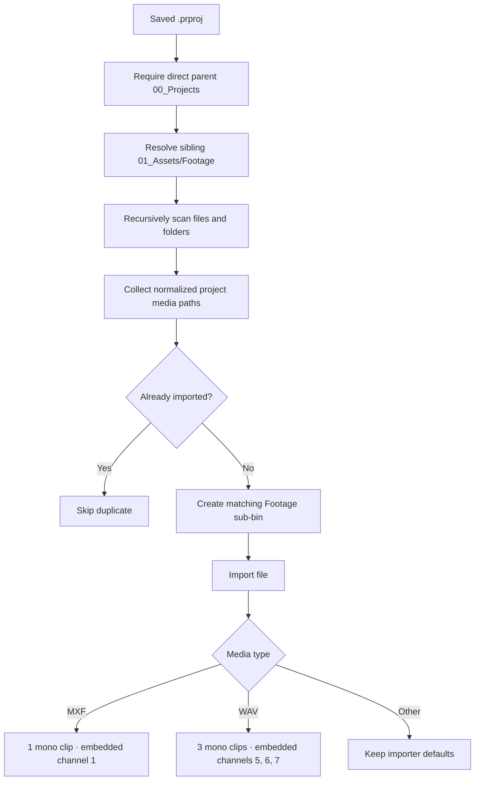
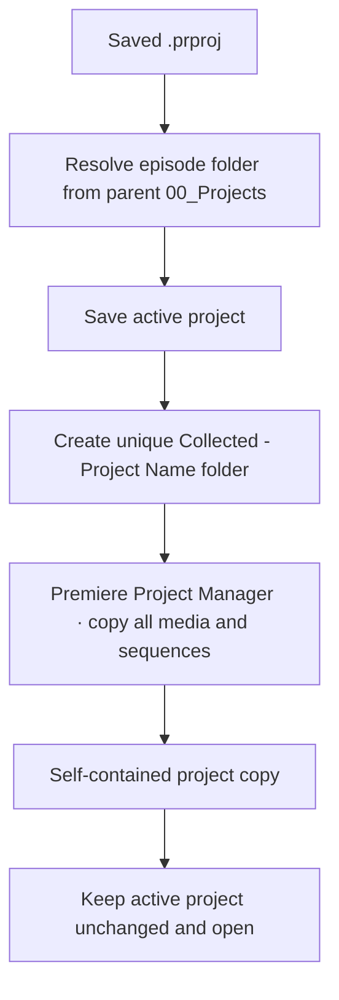

# Architecture

## Overview

Unscripted-Podcast is an Adobe CEP panel with two cooperating layers:

1. A browser-based panel UI.
2. ExtendScript modules running inside Premiere Pro.
This division keeps project mutations in the host application and the interface
focused on task orchestration and feedback.

## Runtime boundaries

### CEP client

`client/index.html`, `client/css/style.css`, and `client/js/main.js` render the
panel and coordinate tasks.

Responsibilities:

- Collect user configuration.
- Maintain busy, success, and failure states.
- Call host functions through `CSInterface.evalScript`.
- Parse structured host results.
- Present a timestamped diagnostic log.

### ExtendScript host

`host/index.jsx` is the manifest entry point. It supplies shared JSON helpers
and includes the task modules loaded into Premiere's ExtendScript runtime.

| Module | Responsibility |
| --- | --- |
| `episodeSetup.jsx` | Infer the episode media folder, mirror disk hierarchy as bins, skip duplicates, import footage, select matching Project-panel items, and apply recorder-specific source audio mappings. |
| `applyAudioChannelPreset.applescript` | On macOS, select an exact named preset in Premiere's native Modify Clip dialog and confirm it without coordinate-based clicks. |
| `collectEpisode.jsx` | Save the active project and use Premiere Project Manager to create a non-destructive, self-contained episode copy. |
| `markClips.jsx` | Parse timestamps, create markers, clone templates, assemble clip sequences, and add transitions. |
| `renderUnscripted.jsx` | Discover export sequences and queue configured Adobe Media Encoder jobs. |

Host entry points use the `up_` prefix and return a consistent payload:

```json
{
  "ok": true,
  "message": "Human-readable summary",
  "log": "Detailed diagnostic output"
}
```

ExtendScript lacks a native JSON serializer in the targeted runtime, so
`host/index.jsx` constructs and escapes these responses explicitly.

## Timestamp workflow



## Episode setup workflow



## Episode collection workflow



Premiere's ExtendScript API does not support creating a new multicamera source
sequence. The panel therefore prepares a deterministic `Footage` hierarchy and
leaves the supported **Clip → Create Multi-Camera Source Sequence** operation
to the editor.

## Design constraints

- CEP and ExtendScript are legacy Adobe technologies, but they expose host
  capabilities that were required when this tool was built.
- QE DOM is used only for transitions. QE is undocumented, so calls are isolated
  in the clip-building task.
- Adobe Media Encoder preset paths and output destinations are configuration,
  not secrets, and use portable defaults in source control.
- Source audio-channel interpretation first uses Premiere's legacy
  `ProjectItem` mapping API where it is writable. Some Premiere 26.x builds
  expose its format/count properties as read-only. On macOS, Configure Footage
  Audio works around that regression by batch-selecting Project items, opening
  Premiere's native Audio Channels dialog, and choosing `Unscripted-MXF1` or
  `Unscripted-WAV3` through semantic Accessibility controls. This helper is
  deliberately isolated and does not use screen coordinates.

## Failure handling

Tasks validate their prerequisites before modifying the project:

- Open and saved Premiere project.
- Expected source/template sequences.
- Parseable timestamp file.
- Valid timestamp ranges.
- Existing export bin and Media Encoder presets.

The panel disables conflicting actions while a task runs and surfaces detailed
diagnostics without relying on modal alerts.

## Testing strategy

Repository automation performs fast static validation:

- JavaScript syntax.
- ExtendScript module syntax where compatible with Node's parser.
- Manifest XML well-formedness.
- Required entry-point presence.

Integration validation remains manual because Premiere's DOM, QE calls, media
decoding, and Media Encoder queueing require an installed Adobe host and sample
project.
